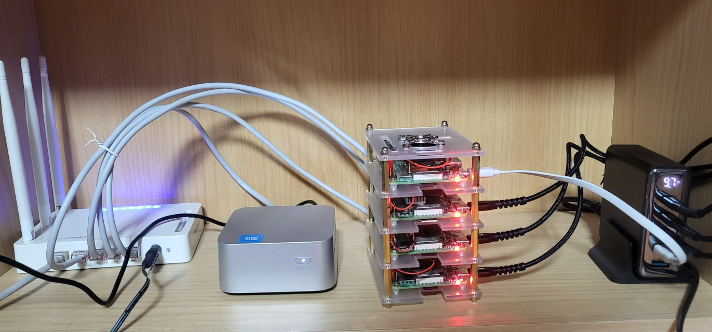
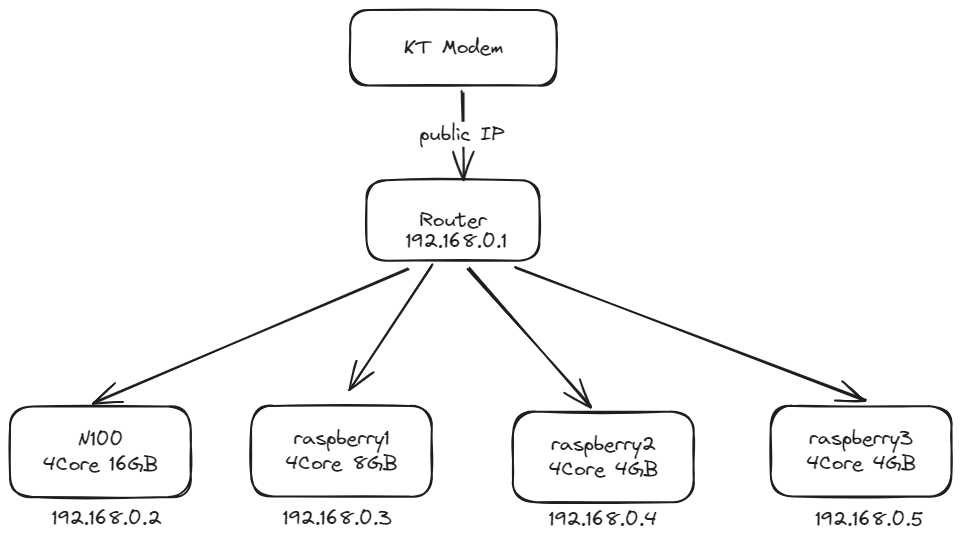
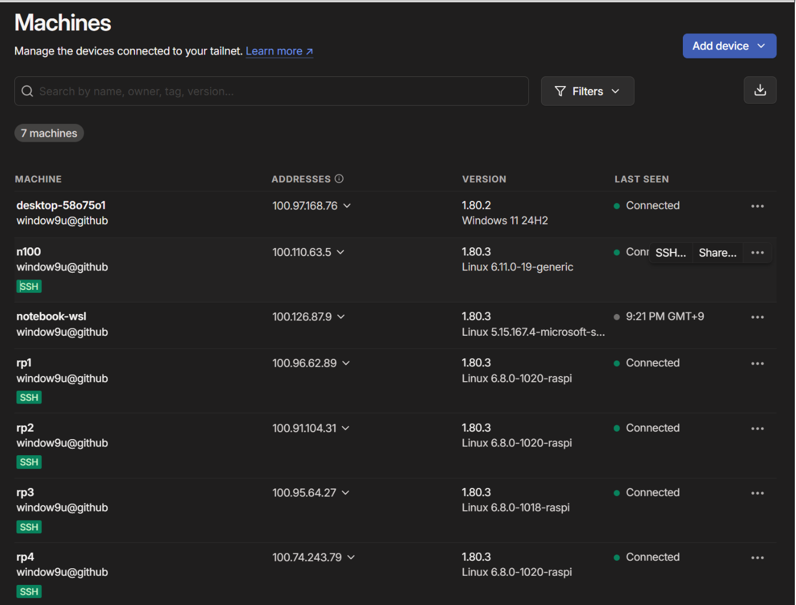

### Hardware specs  


#### Computer
- n100 (4 cores, 16GB RAM)  
  - Tailscale + AnyDesk + Ubuntu Desktop  
- Raspberry Pi 4B (4 cores, 8GB RAM)  
  - Tailscale + Ubuntu Server  
- Raspberry Pi 4B (4 cores, 4GB RAM) x 2  
  - Tailscale + Ubuntu Server  
- Raspberry Pi 3B (1 core, 1GB RAM) (Just had it lying around, so I connected it...)  
  - Tailscale + Ubuntu Server  


### Network


---

### How to connect to a remote machine

---

### AS-IS

### Port Forwarding & DDNS

**Problem**  
- When a machine has a public IP, it's possible to access it externally using DDNS alone.  
- However, in most home setups, machines are behind a router with a private IP.  
  In such cases, there’s no information in the NAT table about where to send incoming packets, so the packets get dropped.

**Solution**  
- On the router, configure **Port Forwarding** so that:  
  When a specific port (e.g., SSH on port 22) receives a request, it forwards that to an internal IP:Port.  
  Example: `RouterIP:22 → 192.168.0.10:22`

**Problem**  
- The combination of DDNS + Port Forwarding is complex to set up and maintain.  
- External access requires multiple configurations and careful security considerations.

---

### TO-BE

---

### Using Tailscale
  

- **Tailscale** is a WireGuard-based P2P VPN that allows remote access **without needing DDNS or Port Forwarding**.

---

### How do remote nodes find each other?

- Each node regularly communicates with the **Tailscale Control Plane**, registering its connection information (IP, public key, etc.).
- Nodes within the same Tailscale network can be identified using internal domain names like:  
  `node-name.tailnet-name.ts.net`
- In this way, Tailscale automatically takes care of DDNS functionality.

---

### But how does it work behind a router?

- Even in typical NAT environments, Tailscale uses **NAT traversal (UDP Hole Punching)** to attempt direct peer-to-peer connections.
- If that fails, it falls back to using **Tailscale DERP** (relay servers) for communication.
- As a result:
  - No need to configure port forwarding
  - Nodes behind routers can still connect automatically
  - Feels like operating on the same local network

---

### Things to Investigate Further

Result of running `ip addr show` on a remote node:
```bash
5: tailscale0: <POINTOPOINT,MULTICAST,NOARP,UP,LOWER_UP> mtu 1280 qdisc fq_codel state UNKNOWN group default qlen 500
    link/none
    inet 100.110.63.5/32 scope global tailscale0
       valid_lft forever preferred_lft forever
    inet6 fd7a:115c:a1e0::7701:3f05/128 scope global
       valid_lft forever preferred_lft forever
    inet6 fe80::1697:b603:73ae:e74d/64 scope link stable-privacy
       valid_lft forever preferred_lft forever
```

- MTU is set to 1280 to avoid fragmentation during packet encapsulation (VPN).  
- What do `<POINTOPOINT,MULTICAST,NOARP,UP,LOWER_UP>` mean?  
- Is `NOARP` used to prevent ARP spoofing?  
- Does `POINTOPOINT` imply this is a point-to-point interface using the `100.64.x.x` CGNAT IP range?  
- Packet encapsulation in VPN?

Comparison with a general router-assigned IP:
```
2: enp1s0: <BROADCAST,MULTICAST,UP,LOWER_UP> mtu 1500 qdisc fq_codel state UP group default qlen 1000
    link/ether 68:1d:ef:45:2b:4c brd ff:ff:ff:ff:ff:ff
    inet 192.168.0.6/24 brd 192.168.0.255 scope global dynamic noprefixroute enp1s0
       valid_lft 6488sec preferred_lft 6488sec
    inet6 fe80::6a1d:efff:fe45:2b4c/64 scope link
       valid_lft forever preferred_lft forever
```

### Future works
- Install k8s cluster on my homelab for study
