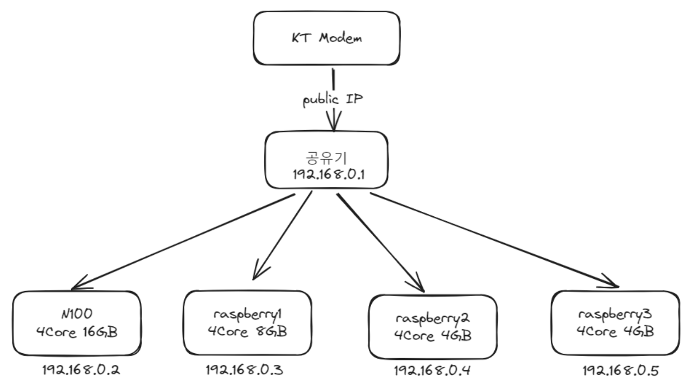

### Node configuration


- n100(4core 16GB)
  - tailscale + anydesk + ubuntu desktop
- raspberrypi 4B (4core 8GB)
  - tailscale + ubuntu server
- rasberrypi 4B (4core 4GB) x 2
  - tailscale + ubuntu server
- raspberrypi 3B (1core 1GB) (그냥 남아서 연결해놓음...)
  - tailscale + ubuntu server

### Network 


### How to connect to remote machine

### Port Forwarding

Problem

- Machine이 공인 IP를 직접 사용하는 경우, DDNS만으로도 외부 접속 가능
- 하지만 대부분의 가정에서는 공유기 뒤에서 private IP를 가지기 때문에, 외부에서 들어오는 패킷을 어디로 보내야 할지 NAT 테이블에 정보가 없어 패킷이 폐기됨

Solve

- 공유기 설정에서 포트 포워딩(port forwarding)을 통해,  
    특정 포트(예: 22번 SSH 요청)가 들어오면 내부 IP:포트로 전달하도록 명시해야 함  
    예: `공유기IP:22 → 192.168.0.10:22`

Problem

- DDNS + Port Forwarding 조합은 설치와 관리가 복잡함
- 외부에서 접근하기 위해 여러 설정과 보안 고려가 필요함

### TO-BE

### Tailscale 사용

- Tailscale은 WireGuard 기반의 P2P VPN으로, 별도 DDNS나 포트 포워딩 없이도 원격 접속 가능하게 해줌

### Remote Node를 어떻게 찾지?

- 각 노드는 Tailscale 제어 서버(Control Plane)와 주기적으로 통신하며, 자신의 접속 정보(IP, 공개키 등)를 등록함
- 서로 Tailscale 네트워크에 속한 노드들은 내부 도메인 (`node-name.tailnet-name.ts.net`) 으로 자동 식별 가능
- 즉, Tailscale이 DDNS 역할을 자동으로 수행함


### 공유기 뒤에 있는데 어떻게 접속하지?

- 일반 NAT 환경에서도 Tailscale은 NAT traversal (UDP Hole Punching) 기법을 사용해 직접 연결 시도
- 실패할 경우, Tailscale DERP (중계 서버)를 통해 통신
- 이 덕분에
    - 별도 포트 포워딩 설정이 필요 없음
    - 공유기 뒤에 있어도 자동으로 연결 가능
    - 마치 같은 로컬 네트워크처럼 동작함

### 더 알아볼 것

remote node에서 `ip addr show` 결과 
```bash
5: tailscale0: <POINTOPOINT,MULTICAST,NOARP,UP,LOWER_UP> mtu 1280 qdisc fq_codel state UNKNOWN group default qlen 500
    link/none
    inet 100.110.63.5/32 scope global tailscale0
       valid_lft forever preferred_lft forever
    inet6 fd7a:115c:a1e0::7701:3f05/128 scope global
       valid_lft forever preferred_lft forever
    inet6 fe80::1697:b603:73ae:e74d/64 scope link stable-privacy
       valid_lft forever preferred_lft forever
```
- packet 캡슐화를 할 때 fragnent를 방지하기 위한 MTU 1280 설정
-  <POINTOPOINT,MULTICAST,NOARP,UP,LOWER_UP> 이 뭘까?
-  NOARP는 arp spoofing 방지?
-  point to point는 ip GNAT 100.64 ~~ ip대역을 의미??
-  packet capsulation(VPN)

일반 공유기에게 할당받은 ip와 비교
```
2: enp1s0: <BROADCAST,MULTICAST,UP,LOWER_UP> mtu 1500 qdisc fq_codel state UP group default qlen 1000
    link/ether 68:1d:ef:45:2b:4c brd ff:ff:ff:ff:ff:ff
    inet 192.168.0.6/24 brd 192.168.0.255 scope global dynamic noprefixroute enp1s0
       valid_lft 6488sec preferred_lft 6488sec
    inet6 fe80::6a1d:efff:fe45:2b4c/64 scope link
       valid_lft forever preferred_lft forever
```
